```{r setup, include=FALSE}
knitr::opts_chunk$set(echo = TRUE)
```

## Introducción

El presente documento busca describir acotadamente la distribución de la población indígena en Chile a partir del Censo del 2017. A propósito de los [Diálogos Ciudadanos](), que se constituyen como un espacio de diálogo y deliberación sobre el anteproyecto elaborado por la Comisión Experta, se crea este repositorio para monitorear la participación de la población autoidentificada con los PP.OO.

El CENSO, elemento sustancial para la elaboración de políticas publicas, posee al interior de su cuestionario la pregunta sobre la *autoidentificación indígena*. Esta se subdivide en dos:

-   p.16 ¿ Se Considera Perteneciente A Pueblo Indígena u Originario? (Sí/No)
-   p.16a ¿ Cuál Pueblo Indígena u Originario?
    1.  Mapuche
    2.  Aymara
    3.  Rapa Nui
    4.  Lican Antai
    5.  Quechua
    6.  Colla
    7.  Diaguita
    8.  Kawésqar
    9.  Yagán o Yámana
    10. Otro

El procesamiento de los datos se realizó a partir del paquete `censo2017`y `chilemapas`, además de la recopilación de datos directa del [SERVEL](https://historico.servel.cl/servel/app/index.php?r=EleccionesGenerico/Default/Geografico&id=224&n=2&v2=13517&v3=0&v4=0).

## Datos a nivel nacional

Según los datos censales 2.185.792 personas se autoidentifican como indígenas.

|              | N             | Porcentaje |
|--------------|---------------|------------|
| **Indígena** | **2.185.792** | **12.44%** |
| No Indígena  | 14.890.284    | 84.73%     |
| No responde  | 497.927       | 02.83%     |
|              | 17.574.003    | 100        |

: Cantidad de personas Indígenas y No Índigenas en Chile

La distribución espacial de la población indígena es:

```{r echo=FALSE, out.width = '120%'}
knitr::include_graphics("img/poblacionindigena_(0)total.png")
```

Ahora, al considerar la cantidad de personas autoidentificadas por pueblo originario queda la composición de la siguiente tabla en que se considera tanto a la alternativa que incluye "otro" y otra que solo contempla los PP.OO de las opciones predispuestas del diccionario.

|                    | N         | Porcentaje | **Porcentaje sin otro** |
|--------------------|-----------|------------|-------------------------|
| Mapuche            | 1.691.629 | 77,4 %     | **83,1%**               |
| Aymara             | 156.754   | 7,2%       | **7,7%**                |
| Rapa Nui           | 9.399     | 0,4%       | **0,5%**                |
| Lican Antai        | 30.369    | 1,4%       | **1,5%**                |
| Quechua            | 33.868    | 1,5%       | **1,7%**                |
| Colla              | 20.744    | 0,9%       | **1,0%**                |
| Diaguita           | 88.474    | 4,0%       | **4,3%**                |
| Kawésqar           | 3.448     | 0,2%       | **0,2%**                |
| Yagán              | 1600      | 0,1%       | **0,1%**                |
| Otro               | 149.507   | 6,8%       |                         |
| Total              | 2.185.792 |            |                         |
| **Total sin otro** |           |            | **2.036.285**           |

: Autoidentificación por PP.OO

Dado que los datos de la respuesta otro no se encuentran del todo codificados, se sugiere utilizar el "**Total sin otro**"

En base a lo anterior, si realizamos una proyección para los diálogos ciudadanos con una participación de 7.500, 10.000, 12.500 y 15.000 personas esta debería ser la proporción estimada:

|             | **7.5k** | **10k** | **12.5k** | **15k** |
|-------------|----------|---------|-----------|---------|
| Mapuche     | 6.231    | 8.307   | 10.384    | 12.461  |
| Aymara      | 577      | 770     | 962       | 1155    |
| Rapa Nui    | 35       | 46      | 58        | 69      |
| Lican Antai | 112      | 149     | 186       | 224     |
| Quechua     | 125      | 166     | 208       | 249     |
| Colla       | 76       | 102     | 127       | 153     |
| Diaguita    | 326      | 434     | 543       | 652     |
| Kawésqar    | 13       | 17      | 21        | 25      |
| Yagán       | 6        | 8       | 10        | 12      |
| **Total**   | 7.500    | 10.000  | 12.500    | 15.000  |

: Proyección para Diálogos Ciudadanos Según PP.OO

Considerando las recientes [Elecciones de Consejeros Constitucionales (2023)](https://www.servelelecciones.cl/#/votacion/elecciones_consejo_ind/pais/8056), la participación de los PP.OO tuvo un mejor desempeño en comparación con la de los [Convencionales Constituyentes](https://historico.servel.cl/servel/app/index.php?r=EleccionesGenerico&id=224).

En la siguiente tabla se aprecia la cantidad de votos de los PP.OO en cada cada una de las votaciones a nivel nacional.

| Elección                                 | N          |
|------------------------------------------|------------|
| Elección de Convecionales Constituyentes | 282.609    |
| Elección de consejeros constitucionales  | 374.735    |
| **Diferencia**                           | **92.144** |

: Votación de PP.OO por elección a nvel nacional

Al identificar la votación nivel región, se aprecia que solo dos regiones tuvieron una menor partipación: Región de Arica y Parinacota y Región de Tarapacá; mientras que las regiones de Ñuble y Magallanes aumentaron casi en un 100% su participación.

En la siguiente tabla se detalla el comportamiento de la participación electoral de los PP.OO en las dos votaciones:

| Región        | Elección de Convencionales | Elección de Consejeros Constitucionales | Diferencia      |
|---------------|----------------------------|-----------------------------------------|-----------------|
| Arica         | 9.004                      | 6.132                                   | -2.872 (-31,9%) |
| Tarapacá      | 11.468                     | 8.541                                   | -2.927 (-25,5%) |
| Antofagasta   | 11.204                     | 13.055                                  | 1.851 (16,5%)   |
| Atacama       | 8.16                       | 11.239                                  | 3.183 (39,1%)   |
| Coquimbo      | 5.326                      | 9.949                                   | 4.623 (86,8%)   |
| Valparaíso    | 10.941                     | 15.808                                  | 4.867 (44,5%)   |
| Metropolitana | 70.391                     | 92.411                                  | 22.020 (31,3%)  |
| O'Higgins     | 4.042                      | 7.818                                   | 3.776 (93,4%)   |
| Maule         | 3.766                      | 6.667                                   | 2.901 (77,0%)   |
| Ñuble         | 1.309                      | 2.557                                   | 1.248 (95,3%)   |
| Bío Bío       | 21.247                     | 28.843                                  | 7.596 (35,8%)   |
| Araucanía     | 65.134                     | 87.725                                  | 22.591 (34,7%)  |
| Los Ríos      | 15.696                     | 19.993                                  | 4.297 (27,4%)   |
| Los Lagos     | 37.760                     | 51.751                                  | 13.991 (37,1%)  |
| Aysén         | 3.476                      | 4.937                                   | 1.461 (42,0%)   |
| Magallanes    | 3.699                      | 7.327                                   | 3.528 (95,6%)   |
| **Total**     | **282.609**                | **374.753**                             |                 |

: Votación de PP.OO a Nivel Regional

## Datos de PP.OO a nivel regional.

Los datos a nivel regional tiene una distribución no homogénea. Cada una de las regiones tiene una predominancia sobre algún pueblo originario en específico, además de poseer diferentes densidades en sus respectivas comunas.

En línea base a una proyección de participación de 7.500 personas, la proporción por región y pueblo originario debería ser la siguiente:

|             | Arica y Parinacota | Tarapacá | Antofagasta | Atacama | Coquimbo |
|-------------|--------------------|----------|-------------|---------|----------|
| Mapuche     | 29                 | 46       | 64          | 33      | 91       |
| Aymara      | 219                | 180      | 47          | 10      | 20       |
| Rapa Nui    | 0,1                | 0,3      | 0           | 0       | 1        |
| Lican Antai | 3                  | 3        | 93          | 1       | 4        |
| Quechua     | 10                 | 28       | 38          | 3       | 3        |
| Colla       | 312                | 3        | 4           | 52      | 7        |
| Diaguita    | 7                  | 23       | 31          | 97      | 97       |
| Kawésqar    | 0                  | 0        | 0           | 0       | 0        |
| Yagán       | 0                  | 0,       | 0           | 0       | 0        |
| **Total**   | **269**            | **284**  | **279**     | **197** | **224**  |

: Proyección para zona norte

|             | Valparaíso | Metropolitana | O'higgins | Maule   | Bío - Bío |
|-------------|------------|---------------|-----------|---------|-----------|
| Mapuche     | 338        | 2.252         | 189       | 163     | 636       |
| Aymara      | 22         | 59            | 4         | 3       | 6         |
| Rapa Nui    | 17         | 11            | 1         | 1       | 2         |
| Lican Antai | 2          | 4             | 0         | 0       | 1         |
| Quechua     | 4          | 31            | 2         | 1       | 2         |
| Colla       | 3          | 5             | 1         | 0       | 1         |
| Diaguita    | 26         | 35            | 3         | 2       | 2         |
| Kawésqar    | 1          | 4             | 0         | 0       | 1         |
| Yagán       | 1          | 2             | 0         | 0       | 0         |
| **Total**   | **412**    | **2.402**     | **200**   | **170** | **651**   |

: Proyección para zona centro

|             | Arucanía  | Los Ríos | Los Lagos | Aysén   | Magallanes |
|-------------|-----------|----------|-----------|---------|------------|
| Mapuche     | 1.154     | 339      | 688       | 98      | 112        |
| Aymara      | 2         | 1        | 3         | 1       | 1          |
| Rapa Nui    | 1         | 0        | 1         | 0       | 0          |
| Lican Antai | 0         | 0        | 0         | 0       | 0          |
| Quechua     | 1         | 0        | 1         | 0       | 0          |
| Colla       | 0         | 0        | 0         | 0       | 0          |
| Diaguita    | 1         | 0        | 1         | 0       | 1          |
| Kawésqar    | 0         | 0        | 1         | 0       | 4          |
| Yagán       | 0         | 0        | 0         | 0       | 1          |
| **Total**   | **1.158** | **341**  | **696**   | **100** | **118**    |

: Proyección para zona sur

## Comentarios Finales

## Anexo

### Región de Arica y Parinacota

En la Región de Arica el 34,9% de la población se autoidentifica como indígena.

|              | N          | Porcentaje |
|--------------|------------|------------|
| **Indígena** | **78.881** | **34,9%**  |
| No Indígena  | 142.038    | 62,8%      |
| NA           | 5.147      | 2,3%       |
| Total        | 226.068    | 100%       |

: Población indígena en la Región de Arica

La distribución espacial de personas que se autoidentifican como indígenas es la siguiente

```{r echo=FALSE, out.width = '100%'}
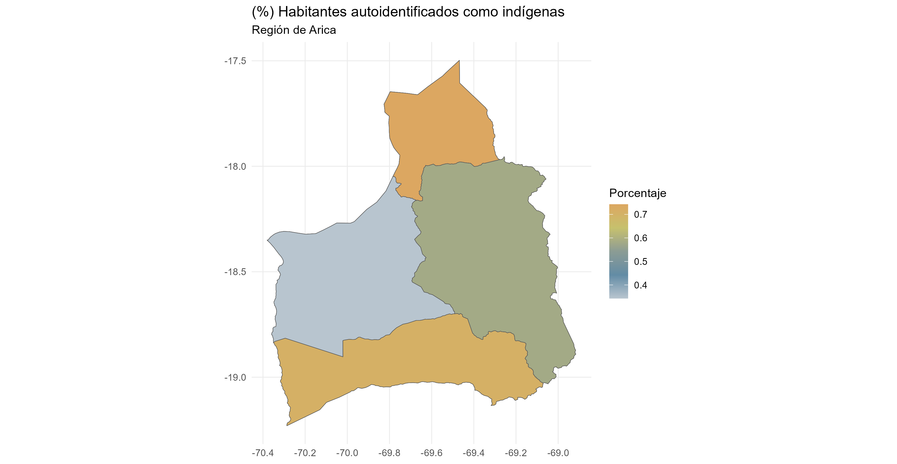
```

El Pueblo Aymara engloba el 75,3% de la población indígena de la región. Lo siguen Mapuche, Quechua y Diaguita

|          | N      | Porcentaje |
|----------|--------|------------|
| Aymara   | 59.432 | 75,3%      |
| Mapuche  | 7.814  | 9,9%       |
| Yagán    | 2.659  | 3,4%       |
| Diaguita | 1.898  | 2,4%       |

### Región de Tarapacá

En la Región de Tarapacá el 24.2% de la población se autoidentifica como indígena.

|              | N          | Porcentaje |
|--------------|------------|------------|
| **Indígena** | **80.065** | **24,2%**  |
| No Indígena  | 242.031    | 73,2%      |
| NA           | 8.462      | 2,6%       |
| Total        | 330.558    | 100%       |

: Población indígena en la Región de Tarapacá

La distribución espacial de personas que se autoidentifican como indígenas es la siguiente

```{r echo=FALSE, out.width = '100%'}
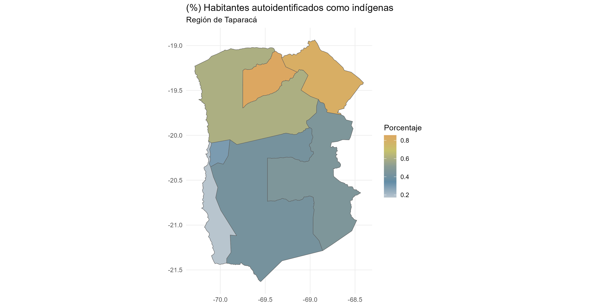
```

Mientras tanto, los cuatro pueblos que mayor presencia tienen son los siguientes:

|          | N      | Porcentaje |
|----------|--------|------------|
| Aymara   | 48.694 | 61,2%      |
| Mapuche  | 12.367 | 15,4%      |
| Quechua  | 7.580  | 9,5%       |
| Diaguita | 6.313  | 7,9%       |

: Pueblos Originarios con mayor presencia en en la Región de Tarapacá

### Región de Antogasta

En la Región de Antogasta el 13.6% de la población se autoidentifica como indígena.

|              | N          | Porcentaje |
|--------------|------------|------------|
| **Indígena** | **82.412** | **13,6%**  |
| No Indígena  | 503.324    | 82,9%      |
| NA           | 21.780     | 3,6%       |
| Total        | 607.534    | 100%       |

: Población indígena en la Región de Tarapacá

La distribución espacial de personas que se autoidentifican como indígenas es la siguiente

```{r echo=FALSE, out.width = '100%'}
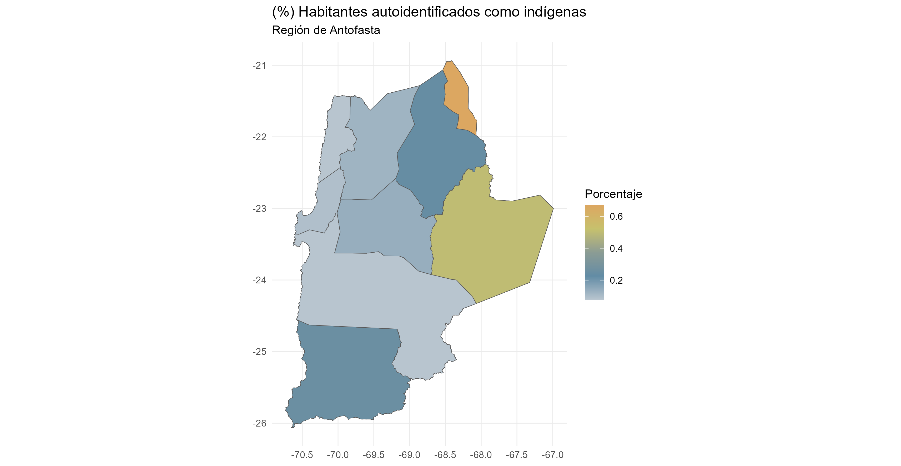
```

Mientras tanto, los cuatro pueblos que mayor presencia tienen son los siguientes:

|          | N      | Porcentaje |
|----------|--------|------------|
| Diaguita | 25.262 | 30,7%      |
| Colla    | 17.430 | 21,1%      |
| Mapuche  | 12.861 | 15,6%      |
| Aymara   | 10.446 | 12,7%      |

### Región de Atacama

En la Región de Antogasta el 19.4% de la población se autoidentifica como indígena.

|              | N          | Porcentaje |
|--------------|------------|------------|
| **Indígena** | **55.412** | **19,4%**  |
| No Indígena  | 225.511    | 78,8%      |
| NA           | 5.244      | 1,8%       |
| Total        | 286.534    | 100%       |

: Población indígena en la Región de Tarapacá

La distribución espacial de personas que se autoidentifican como indígenas es la siguiente

```{r echo=FALSE, out.width = '100%'}
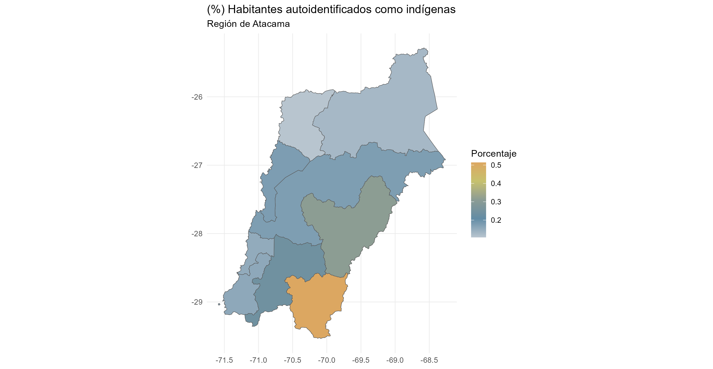
```

Mientras tanto, los cuatro pueblos que mayor presencia tienen son los siguientes:

|          | N      | Porcentaje |
|----------|--------|------------|
| Diaguita | 26.381 | 47,6%      |
| Colla    | 14.054 | 25,4%      |
| Mapuche  | 9.020  | 16,3%      |
| Aymara   | 2.716  | 4,9%       |

### Región de Coquimbo

En la Región de Coquimbo el 8.6% de la población se autoidentifica como indígena.

|              | N          | Porcentaje |
|--------------|------------|------------|
| **Indígena** | **65.956** | **8,6%**   |
| No Indígena  | 665.757    | 87,9%      |
| NA           | 26.873     | 3,5%       |
| Total        | 757.586    | 100%       |

: Población indígena en la Región de Coquimbo

La distribución espacial de personas que se autoidentifican como indígenas es la siguiente

```{r echo=FALSE, out.width = '100%'}
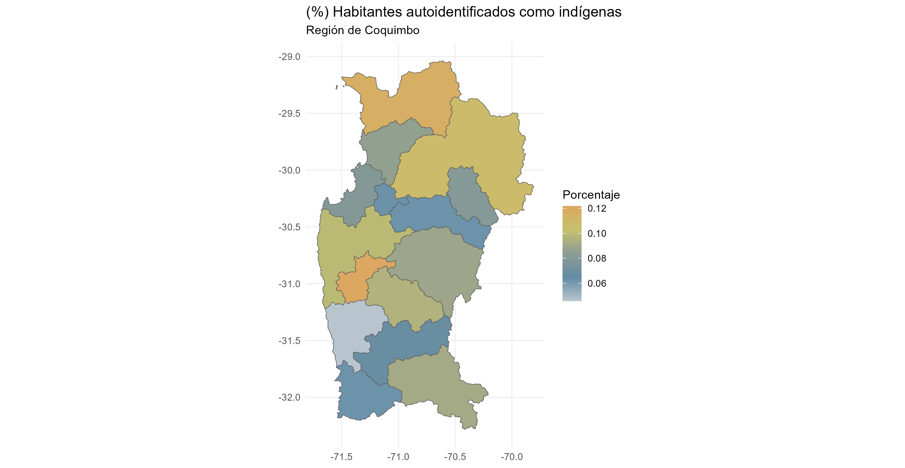
```

Mientras tanto, los cuatro pueblos que mayor presencia tienen son los siguientes:

|          | N      | Porcentaje |
|----------|--------|------------|
| Diaguita | 26.470 | 40,8%      |
| Mapuche  | 24.750 | 38,1%      |
| Aymara   | 5.530  | 8,5%       |
| Colla    | 1.939  | 3,0%       |

### Región de Valparaíso

En la Región de Valparaíso el 6.6% de la población se autoidentifica como indígena.

|              | N           | Porcentaje |
|--------------|-------------|------------|
| **Indígena** | **119.751** | **6,6%**   |
| No Indígena  | 1.635.62    | 90,1%      |
| NA           | 60.350      | 3,3%       |
| Total        | 1.815.902   | 100%       |

: Población indígena en la Región de Valparaíso

La distribución espacial de personas que se autoidentifican como indígenas es la siguiente

```{r echo=FALSE, out.width = '100%'}
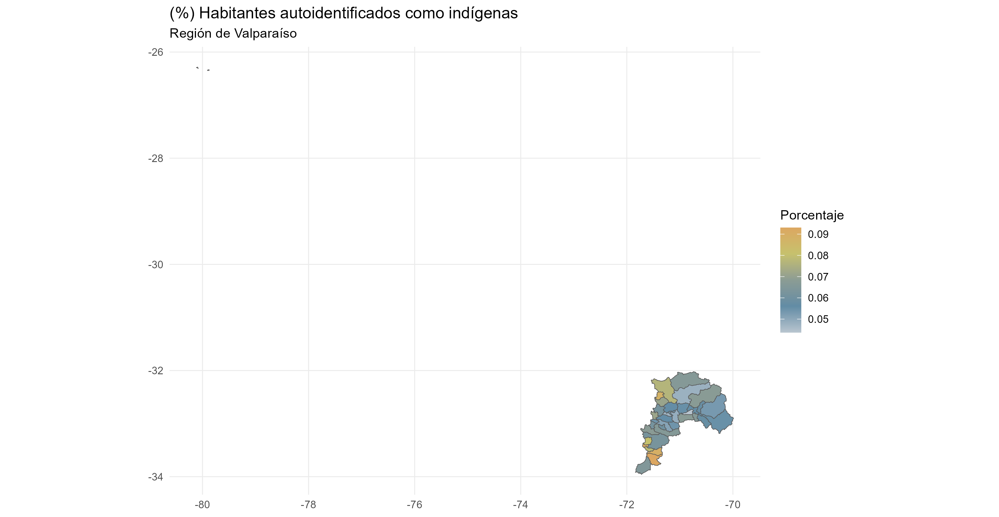
```

Mientras tanto, los cuatro pueblos que mayor presencia tienen son los La

Los grupos más predomianntes son los siguientes:

|          | N      | Porcentaje |
|----------|--------|------------|
| Mapuche  | 91.744 | 76,6%      |
| Diaguita | 6.928  | 5,8%       |
| Aymara   | 5.581  | 4,9%       |
| Rapa Nui | 4.566  | 3,8%       |

### Región de O'Higgins

En la Región de Valparaíso el 6.6% de la población se autoidentifica como indígena.

|              | N          | Porcentaje |
|--------------|------------|------------|
| **Indígena** | **57.820** | **6,3%**   |
| No Indígena  | 830.481    | 90,8%      |
| NA           | 26.749     | 2,9%       |
| Total        | 914.555    | 100%       |

: Población indígena en la Región de Valparaíso

La distribución espacial de personas que se autoidentifican como indígenas es la siguiente

```{r echo=FALSE, out.width = '100%'}
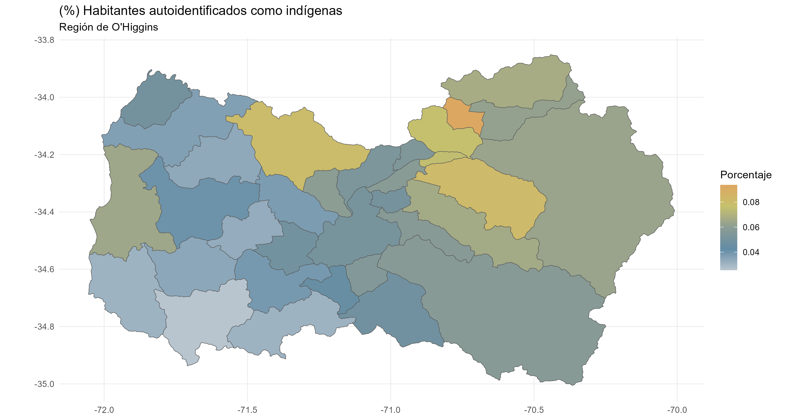
```

El grupo mapuche engloba el 90% de la población indígena de la región

|         | N      | Porcentaje |
|---------|--------|------------|
| Mapuche | 51.244 | 89,5%      |

### Región de Maule

En la Región del Maule el 6.6% de la población se autoidentifica como indígena.

|              | N          | Porcentaje |
|--------------|------------|------------|
| **Indígena** | **49.013** | **4,7%**   |
| No Indígena  | 959.245    | 91,8%      |
| NA           | 36.692     | 3,5%       |
| Total        | 1.044.950  | 100%       |

: Población indígena en la Región de Maule

La distribución espacial de personas que se autoidentifican como indígenas es la siguiente

```{r echo=FALSE, out.width = '100%'}
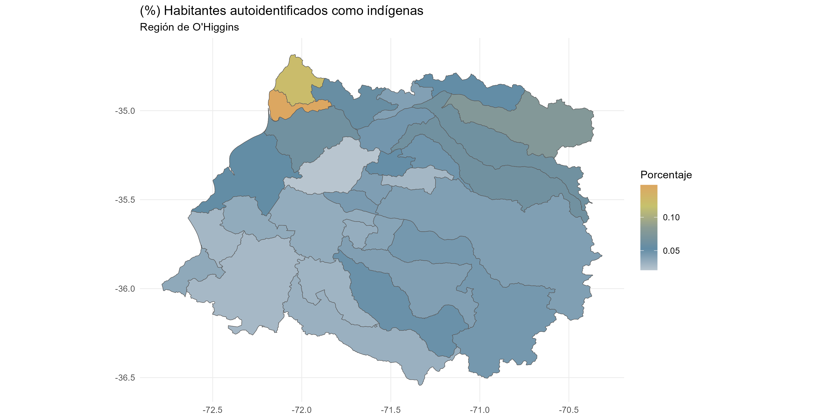
```

El pueblo mapuche engloba el 90% de la población indígena de la región

|         | N      | Porcentaje |
|---------|--------|------------|
| Mapuche | 44.140 | 90,1%      |
| Aymara  | 689    | 1,4%       |

### Región del Bío Bío

En la Región del Maule el 6.6% de la población se autoidentifica como indígena.

|              | N           | Porcentaje |
|--------------|-------------|------------|
| **Indígena** | **189.632** | **8,3%**   |
| No Indígena  | 1.796.451   | 88,2%      |
| NA           | 51.331      | 2,5%       |
| Total        | 1.044.950   | 100%       |

: Población indígena en la Región del Bío Bío

La distribución espacial de personas que se autoidentifican como indígenas es la siguiente

```{r echo=FALSE, out.width = '100%'}
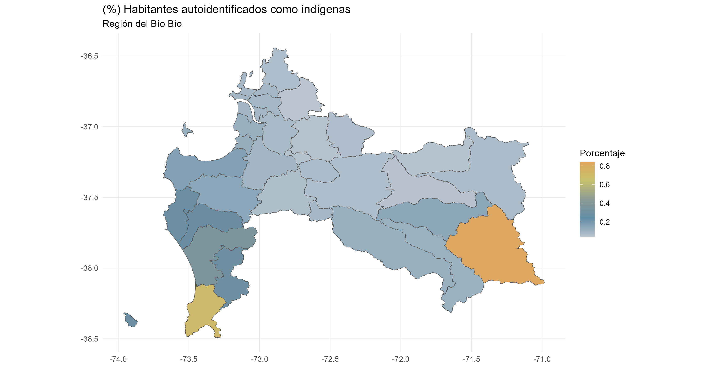
```

El pueblomapuche engloba el 91,0% de la población indígena de la región

|         | N       | Porcentaje |
|---------|---------|------------|
| Mapuche | 172.652 | 91,0%      |
| Aymara  | 1.655   | 0,9%       |

### Región de la Araucanía

En la Región del la Araucanía el 33.6% de la población se autoidentifica como indígena.

|              | N           | Porcentaje |
|--------------|-------------|------------|
| **Indígena** | **321.328** | **33,6%**  |
| No Indígena  | 615.847     | 64,3%      |
| NA           | 20.049      | 2,1%       |
| Total        | 957.224     | 100%       |

: Población indígena en la Región de la Araucanía

La distribución espacial de personas que se autoidentifican como indígenas es la siguiente

```{r echo=FALSE, out.width = '100%'}
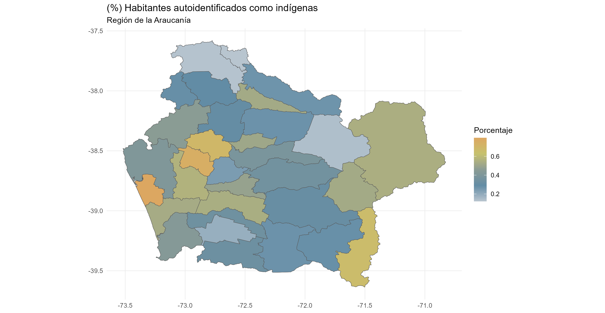
```

El Pueblo Mapuche engloba el 97,5% de la población indígena de la región

|         | N       | Porcentaje |
|---------|---------|------------|
| Mapuche | 313.188 | 97,5%      |

### Región de Los Ríos

En la Región de Los Ríos el 25% de la población se autoidentifica como indígena.

|              | N          | Porcentaje |
|--------------|------------|------------|
| **Indígena** | **96.311** | **25%**    |
| No Indígena  | 279.675    | 72,7%      |
| NA           | 8851       | 2,3%       |
| Total        | 957.224    | 100%       |

: Población indígena en la Región de Los Rís

La distribución espacial de personas que se autoidentifican como indígenas es la siguiente

```{r echo=FALSE, out.width = '100%'}
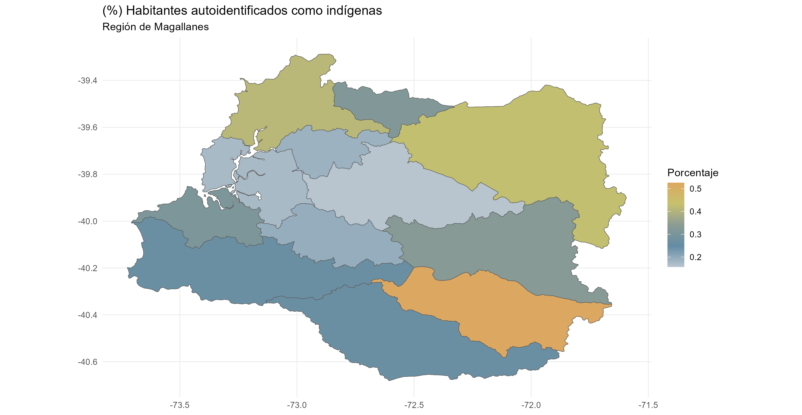
```

El Pueblo Mapuche engloba el 95,5% de la población indígena de la región

|         | N      | Porcentaje |
|---------|--------|------------|
| Mapuche | 91.951 | 95,5%      |

### Región de Los Lagos

En la Región de Los Lagos el 27% de la población se autoidentifica como indígena.

|              | N          | Porcentaje |
|--------------|------------|------------|
| **Indígena** | **29.075** | **28,1%**  |
| No Indígena  | 72.273     | 70,1%      |
| NA           | 1.810      | 1,8%       |
| Total        | 103.158    | 100%       |

: Población indígena en la Región de Los Lagos

La distribución espacial de personas que se autoidentifican como indígenas es la siguiente

```{r echo=FALSE, out.width = '100%'}
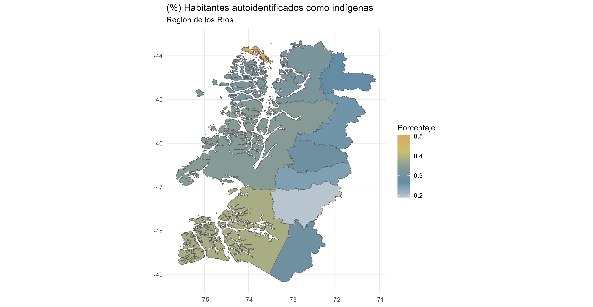
```

El Pueblo Mapuche engloba el 81,7% de la población indígena de la región

|          | N       | Porcentaje |
|----------|---------|------------|
| Mapuche  | 186.854 | 81,7%      |
| Aymara   | 830     | 0,4%       |
| Diaguita | 830     | 0,4%       |

### Región de Aysén

En la Región de Aysén el 28% de la población se autoidentifica como indígena.

|              | N          | Porcentaje |
|--------------|------------|------------|
| **Indígena** | **29.075** | **28,2%**  |
| No Indígena  | 72.273     | 70,1%      |
| NA           | 1.810      | 1,8%       |
| Total        | 103.158    | 100%       |

: Población indígena en la Región de Aysén

La distribución espacial de personas que se autoidentifican como indígenas es la siguiente

```{r echo=FALSE, out.width = '100%'}

```

El Pueblo Mapuche engloba el 81,7% de la población indígena de la región. Lo siguen los Kawésqar y Yaganes

|          | N      | Porcentaje |
|----------|--------|------------|
| Mapuche  | 26.570 | 91,4%      |
| Aymara   | 162    | 0,6%       |
| Kawésqar | 117    | 0,4%       |

: Población indígena en la Región de Aysén

### Región de Magallanes

En la Región de Magallanes el 22,7% de la población se autoidentifica como indígena.

|              | N          | Porcentaje |
|--------------|------------|------------|
| **Indígena** | **37.791** | **22,7%**  |
| No Indígena  | 125.946    | 75,6%      |
| NA           | 2.796      | 1,7%       |
| Total        | 166.533    | 100%       |

: Población indígena en la Región de Magallanes

La distribución espacial de personas que se autoidentifican como indígenas es la siguiente

```{r echo=FALSE, out.width = '100%'}
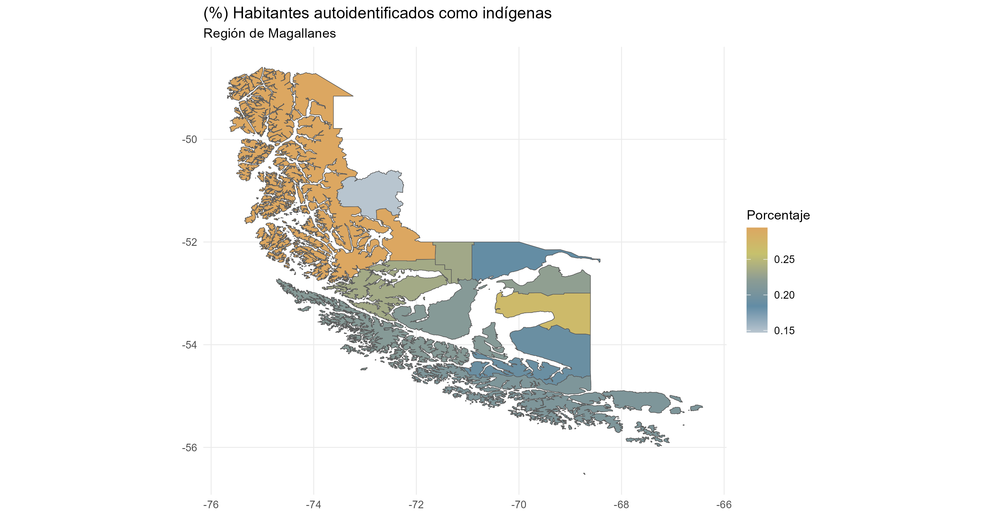
```

El Pueblo Mapuche engloba el 80,6% de la población indígena de la región. Lo siguen los Kawésqar y Yaganes

|          | N      | Porcentaje |
|----------|--------|------------|
| Mapuche  | 30.463 | 80,6%      |
| Kawésqar | 955    | 2,5%       |
| Yagán    | 306    | 0,8%       |

: Población indígena en la Región de Magallanes

### Región Metropolitana

En la Región Metropolitana el 22,7% de la población se autoidentifica como indígena.

|              | N           | Porcentaje |
|--------------|-------------|------------|
| **Indígena** | **695.116** | **9,8%**   |
| No Indígena  | 6.214.240   | 87,4%      |
| NA           | 203.452     | 2,9%       |
| Total        | 7.112.208   | 100%       |

: Población indígena en la Región Metropolitana

La distribución espacial de personas que se autoidentifican como indígenas es la siguiente

```{r echo=FALSE, out.width = '100%'}
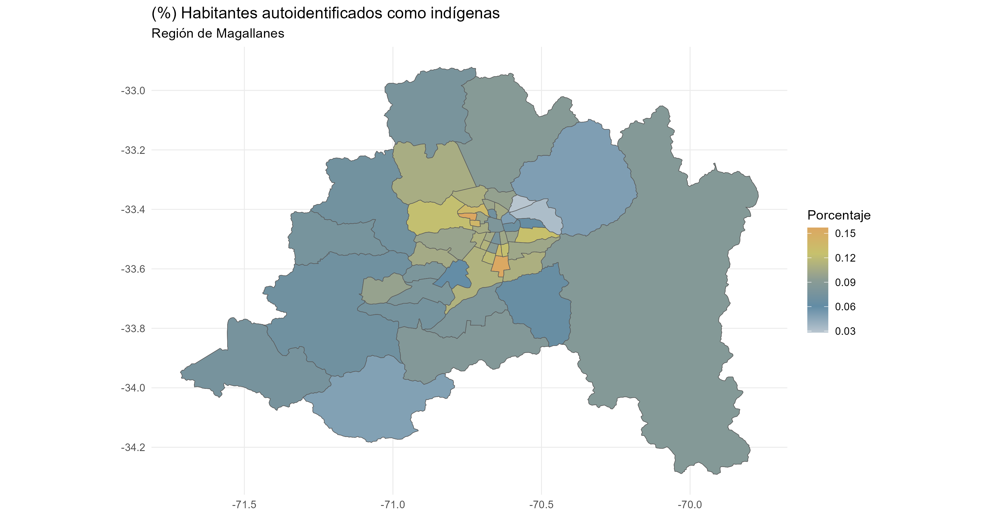
```

El Pueblo Mapuche engloba el 80,6% de la población indígena de la región. Lo siguen los Kawésqar y Yaganes

|          | N       | Porcentaje |
|----------|---------|------------|
| Mapuche  | 611.412 | 88,0%      |
| Aymara   | 15.988  | 2,3%       |
| Diaguita | 9.381   | 1,3%       |
